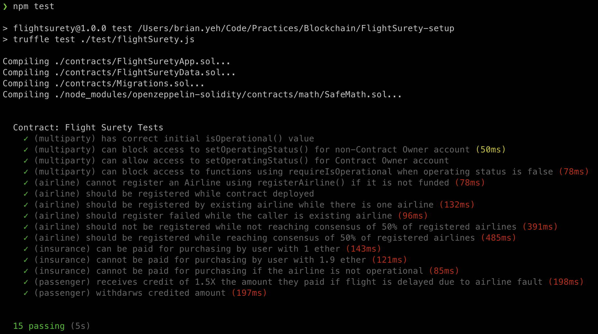
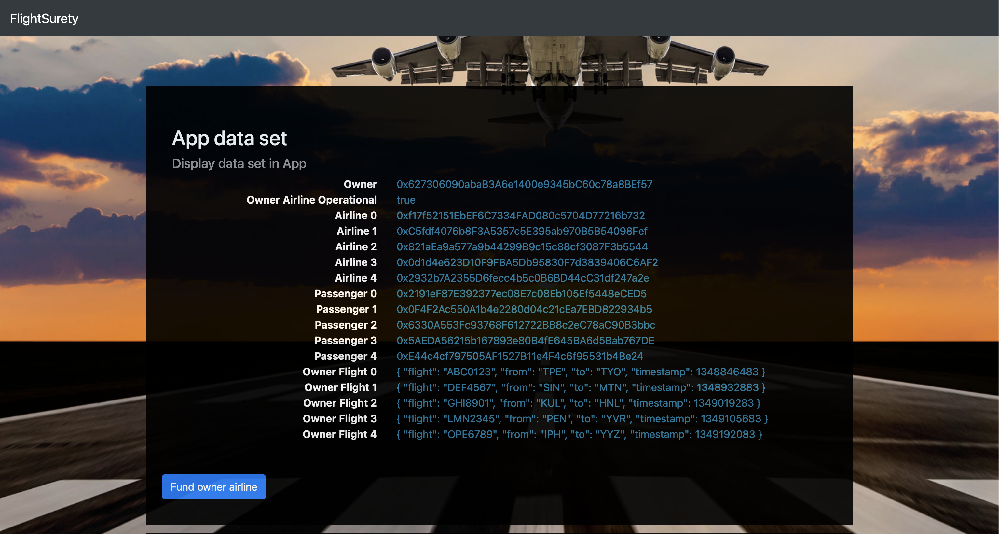
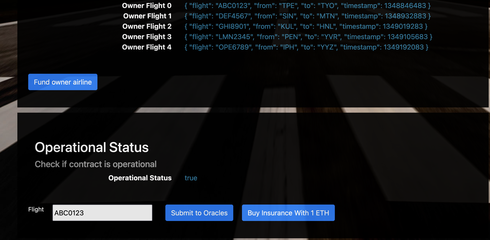

# FlightSurety

FlightSurety is a sample application project for Udacity's Blockchain course.

# Set up project

## Install node modules

Be sure the service version before installing modules.

node: v8.17.0
npm: 6.13.4
truffle: v4.1.14

Then install node modules: `npm install`


## Create local Blockchain with ganachi-cli

Create 50 accounts and there are 10000 ETH in each accounts' balance.

```
ganache-cli --defaultBalanceEther 10000 --accounts 50 --mnemonic "candy maple cake sugar pudding cream honey rich smooth crumble sweet treat"
```

The result should look like following:


## Run tests

Run tests to confirm that project is set up successfully.

```
npm test
```

The result should look like following:



Or run oracles test cases:

```
npm run test:oracles
```

## Develop Client

To run truffle tests:

`truffle test ./test/flightSurety.js`
`truffle test ./test/oracles.js`

To use the dapp:

`truffle migrate`
`npm run dapp`

To view dapp:

`http://localhost:8000`

## Develop Server

`npm run server`


## Requirements
### Separation of Concerns, Operational Control and “Fail Fast”
1. Smart Contract Seperation
    - Smart Contract code is separated into multiple contracts:
        1. FlightSuretyData.sol for data persistence
        2. FlightSuretyApp.sol for app logic and oracles code
2. Dapp Created and Used for Contract Calls
    - A Dapp client has been created and is used for triggering contract calls. Client can be launched with “npm run dapp” and is available at http://localhost:8000
        - Specific contract calls:
            1. Passenger can purchase insurance for flight
            2. Trigger contract to request flight status update
3. Oracle Server Application
    - A server app has been created for simulating oracle behavior. Server can be launched with “npm run server”
4. Operational status control is implemented in contracts
    - Students has implemented operational status control.
5. Fail Fast Contract
    - Contract functions “fail fast” by having a majority of “require()” calls at the beginning of function body

### Airlines
1. Airline Contract Initialization
    - First airline is registered when contract is deployed.
2. Multiparty Consensus
    - Only existing airline may register a new airline until there are at least four airlines registered
    - Demonstrated either with Truffle test or by making call from client Dapp
3. Multiparty Consensus
    - Registration of fifth and subsequent airlines requires multi-party consensus of 50% of registered airlines
    - Demonstrated either with Truffle test or by making call from client Dapp
4. Airline Ante
    - Airline can be registered, but does not participate in contract until it submits funding of 10 ether
    - Demonstrated either with Truffle test or by making call from client Dapp

### Passengers
1. Passenger Airline Choice
    - Passengers can choose from a fixed list of flight numbers and departure that are defined in the Dapp client
2. Passenger Payment
	  - Passengers may pay up to 1 ether for purchasing flight insurance.
3. Passenger Repayment
	  - If flight is delayed due to airline fault, passenger receives credit of 1.5X the amount they paid
4. Passenger Withdraw
	  - Passenger can withdraw any funds owed to them as a result of receiving credit for insurance payout
5. Insurance Payouts
    - Insurance payouts are not sent directly to passenger’s wallet

### Oracles (Server App)
1. Functioning Oracle
    - Oracle functionality is implemented in the server app.

2. Oracle Initialization
    - Upon startup, 20+ oracles are registered and their assigned indexes are persisted in memory
3. Oracle Updates
    - Update flight status requests from client Dapp result in OracleRequest event emitted by Smart Contract that is captured by server (displays on console and handled in code)
4. Oracle Functionality
    - Server will loop through all registered oracles, identify those oracles for which the OracleRequest event applies, and respond by calling into FlightSuretyApp contract with random status code of Unknown (0), On Time (10) or Late Airline (20), Late Weather (30), Late Technical (40), or Late Other (50)

## Screenshots

The DApp will show you all data information.


Passenger can buy insurance after entering the flight number and click `Buy Insurance With 1ETH` button.


